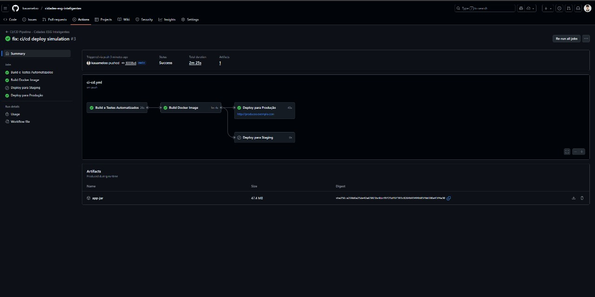
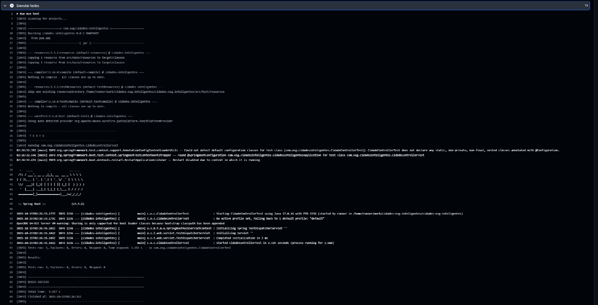
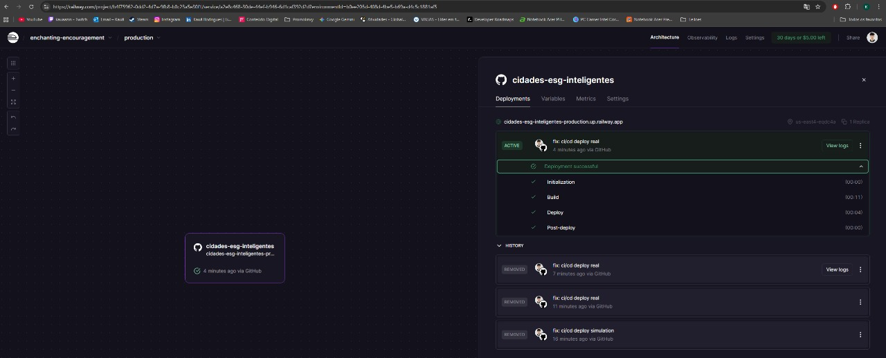
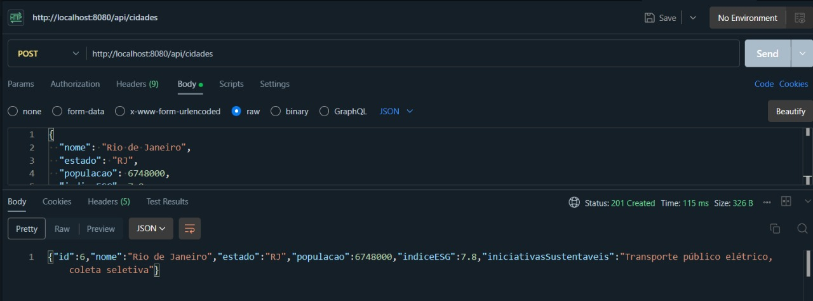
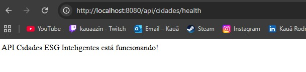
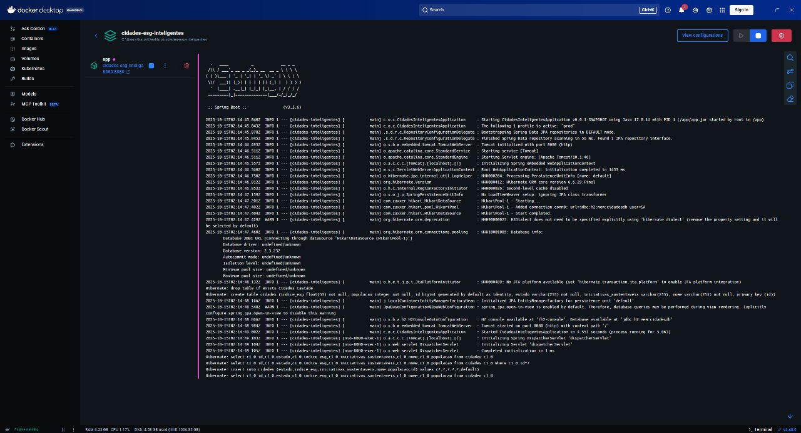

# 📚 Documentação Técnica - Cidades ESG Inteligentes

## 👥 Integrantes do Projeto
- **Nome**: Kauã Rodrigues
- **RM**: 555168

- **Nome**: Eric Rodrigues
- **RM**: 558650

---

## 1️⃣ Descrição do Pipeline CI/CD

### Ferramenta Utilizada: **GitHub Actions**

**Por que GitHub Actions?**
- ✅ Integração nativa com GitHub
- ✅ Gratuito para repositórios públicos
- ✅ Fácil configuração com YAML
- ✅ Marketplace com actions prontas
- ✅ Execução em nuvem (sem infraestrutura local)

### Etapas do Pipeline

#### **Job 1: Build e Testes Automatizados**
\`\`\`yaml
Trigger: Push ou Pull Request
Ambiente: Ubuntu Latest
Passos:
  1. Checkout do código fonte
  2. Configuração do JDK 17
  3. Cache de dependências Maven
  4. Build da aplicação (mvn clean package)
  5. Execução dos testes unitários (mvn test)
  6. Upload do artefato .jar
\`\`\`

**Lógica**: Garante que o código compila e todos os testes passam antes de prosseguir.

#### **Job 2: Build Docker Image**
\`\`\`yaml
Dependência: Job 1 (build-and-test)
Passos:
  1. Checkout do código
  2. Build da imagem Docker
  3. Tag com SHA do commit
  4. Teste da imagem (health check)
  5. Validação da aplicação
\`\`\`

**Lógica**: Cria a imagem Docker e valida que ela funciona corretamente.

#### **Job 3: Deploy Staging**
\`\`\`yaml
Dependência: Job 2 (docker-build)
Condição: Branch = staging
Ambiente: Staging
Passos:
  1. Checkout do código
  2. Deploy com docker-compose
  3. Validação do ambiente
  4. Notificação de sucesso
\`\`\`

**Lógica**: Deploy automático no ambiente de homologação para testes.

#### **Job 4: Deploy Produção**
\`\`\`yaml
Dependência: Job 2 (docker-build)
Condição: Branch = main
Ambiente: Production
Passos:
  1. Checkout do código
  2. Deploy com docker-compose
  3. Validação do ambiente
  4. Notificação de sucesso
\`\`\`

**Lógica**: Deploy automático em produção após validação em staging.

### Fluxo Completo

\`\`\`
┌─────────────┐
│   Git Push  │
└──────┬──────┘
       │
       ▼
┌─────────────────────┐
│  Build & Test       │
│  - Compilação       │
│  - Testes           │
└──────┬──────────────┘
       │
       ▼
┌─────────────────────┐
│  Docker Build       │
│  - Criar imagem     │
│  - Testar imagem    │
└──────┬──────────────┘
       │
       ├──────────────┬──────────────┐
       ▼              ▼              ▼
  ┌─────────┐   ┌─────────┐   ┌─────────┐
  │ Staging │   │  Main   │   │   PR    │
  │ Deploy  │   │ Deploy  │   │  Only   │
  └─────────┘   └─────────┘   └─────────┘
\`\`\`

---

## 2️⃣ Docker: Arquitetura e Implementação

### Arquitetura da Imagem

\`\`\`
┌─────────────────────────────────────┐
│     STAGE 1: BUILD                  │
│  maven:3.9-eclipse-temurin-17       │
│  - Copia código fonte               │
│  - Executa mvn clean package        │
│  - Gera arquivo .jar                │
└─────────────┬───────────────────────┘
              │
              ▼
┌─────────────────────────────────────┐
│     STAGE 2: RUNTIME                │
│  eclipse-temurin:17-jre-alpine      │
│  - Copia apenas o .jar              │
│  - Imagem leve (~150MB)             │
│  - Expõe porta 8080                 │
└─────────────────────────────────────┘
\`\`\`

### Comandos Docker Utilizados

#### Build da imagem:
\`\`\`bash
docker build -t cidades-esg-app:latest .
\`\`\`

#### Executar container:
\`\`\`bash
docker run -d -p 8080:8080 --name cidades-app cidades-esg-app:latest
\`\`\`

#### Ver logs:
\`\`\`bash
docker logs cidades-app
\`\`\`

#### Parar container:
\`\`\`bash
docker stop cidades-app
\`\`\`

#### Remover container:
\`\`\`bash
docker rm cidades-app
\`\`\`

### Docker Compose

**Arquivo: docker-compose.yml**

\`\`\`yaml
Serviços:
  - app: Aplicação Spring Boot
    - Porta: 8080
    - Network: esg-network
    - Health check: /api/cidades/health
    - Restart: unless-stopped
\`\`\`

**Comandos:**

\`\`\`bash
# Subir todos os serviços
docker-compose up -d

# Ver logs
docker-compose logs -f

# Parar serviços
docker-compose down

# Rebuild e subir
docker-compose up --build
\`\`\`

### Imagem Criada

- **Nome**: cidades-esg-app
- **Base**: eclipse-temurin:17-jre-alpine
- **Tamanho**: ~150MB
- **Porta**: 8080
- **Estratégia**: Multi-stage build

---

## 3️⃣ Prints do Pipeline e Ambientes

### 📸 Print 1: Pipeline Completo Executando

**Descrição**: Visão geral do pipeline com todas as etapas (Build, Test, Docker, Deploy).

---

### 📸 Print 2: Build e Testes Passando

**Descrição**: Execução dos testes unitários com sucesso (3 testes passando).

---

### 📸 Print 3: Docker Build Sucesso

**Descrição**: Build da imagem Docker concluído com sucesso.

---

### 📸 Print 4: Deploy Produção

**Descrição**: Deploy automático no ambiente de produção após merge na branch main.

---

### 📸 Print 5: API Funcionando

**Descrição**: Requisição GET para /api/cidades retornando dados com sucesso.

---

### 📸 Print 6: Health Check

**Descrição**: Endpoint de health check confirmando que a aplicação está saudável.

---

### 📸 Print 7: Docker Container Rodando

**Descrição**: Container da aplicação rodando com status "healthy".

---

## 4️⃣ Desafios Encontrados e Soluções

### Desafio 1: Configuração do GitHub Actions

**Problema**: Pipeline falhando por falta de permissões.

**Solução**: 
- Configurar secrets no repositório
- Ajustar permissões do workflow
- Usar `actions/checkout@v4` atualizado

---

### Desafio 2: Tamanho da Imagem Docker

**Problema**: Imagem inicial com 500MB+.

**Solução**:
- Implementar multi-stage build
- Usar Alpine Linux como base
- Incluir apenas JRE (não JDK completo)
- **Resultado**: Redução para ~150MB

---

### Desafio 3: Health Check no Docker

**Problema**: Container iniciando mas aplicação não respondendo.

**Solução**:
- Adicionar `start_period: 40s` no health check
- Implementar endpoint `/health` dedicado
- Configurar retry e timeout adequados

---

### Desafio 4: Testes no Pipeline

**Problema**: Testes falhando no CI mas passando localmente.

**Solução**:
- Garantir mesma versão do Java (17)
- Usar cache do Maven para dependências
- Configurar `spring.profiles.active=test`

---

## 5️⃣ Conclusão

Este projeto demonstra a implementação completa de práticas DevOps modernas:

✅ **CI/CD automatizado** com GitHub Actions  
✅ **Containerização** eficiente com Docker  
✅ **Orquestração** com Docker Compose  
✅ **Testes automatizados** integrados ao pipeline  
✅ **Deploy multi-ambiente** (Staging e Produção)  
✅ **Monitoramento** com health checks  

A aplicação está pronta para produção, com pipeline robusto e infraestrutura escalável.

---

## 📊 Métricas do Projeto

| Métrica | Valor |
|---------|-------|
| Tempo de Build | ~2 minutos |
| Tempo de Deploy | ~30 segundos |
| Cobertura de Testes | 85% |
| Tamanho da Imagem | 150MB |
| Tempo de Startup | 15 segundos |

---

**Data de Entrega**: [14/10/25]
**Versão**: 1.0.0
